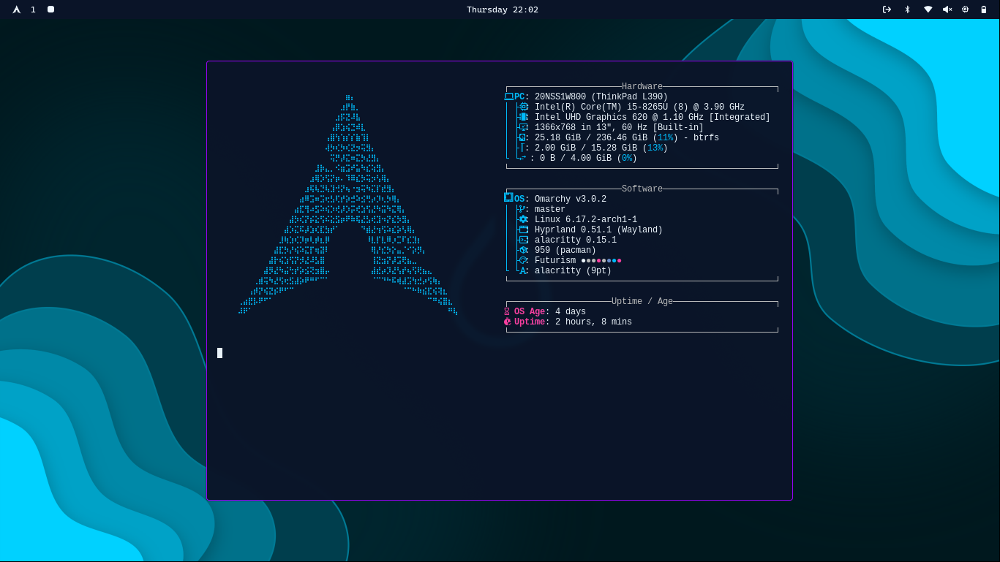

### What is Omarchy
Omarchy is an [omakase](https://learn.omacom.io/3/omacom/76/omakase-computing) distribution based on [Arch Linux](https://archlinux.org/) and the tiling window manager [Hyprland](https://hypr.land/). It ships with just about everything a modern software developer needs to be productive immediately.

Read more at [omarchy.org.](https://omarchy.org/)

### Theme 
I'm using a version of [Futurism](https://github.com/bjarneo/omarchy-futurism-theme) that I modded to fit my needs, as I still can't build a rice from scratch
### screenshots
 
 